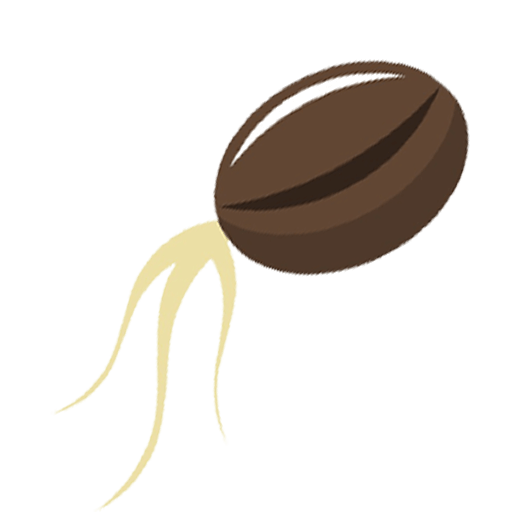

  

<h1 align="center">DJSeed</h1>

DJSeed *(Dee-Jey-Es, See-Duh)* aims to be a quality of life addon for the popular
[Discord](https://discord.com/) interaction library [Discord.js](https://discord.js.org/#/).
It *will eventually* offer a bunch of tools which can be found on the [Roadmap](/docs/starting) *once its made*.
Currently DJSeed offers sharding and multithreading (clusters) which is quite frankly the most asked for thing.
So win, win... *right?*

## Usage
Read the [DOCS](/)

